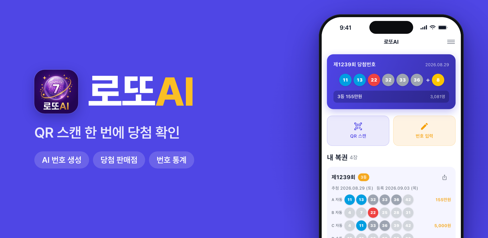

# 로또AI

**QR 스캔 한 번에 당첨 확인**

회원가입 없이 바로 쓰는 무료 로또 앱

복권 QR만 찍으면 등수와 당첨금까지 바로 알려줘요. 
AI 번호 생성부터 당첨 판매점, 번호 통계까지 한 앱에 담았어요.

  

## 로또에 필요한 기능을 한곳에

당첨 확인부터 번호 생성, 통계, 세금 계산까지 챙겼어요. 등록한 복권 기록은 내 기기 안에만 저장돼요.

| | 기능 | 이런 걸 할 수 있어요 |
|:-:|---|---|
| 📷 | **QR 당첨 확인** | 복권 QR을 찍으면 회차·번호·구매방식을 읽고 등수와 당첨금까지 알려줘요. QR이 없으면 번호를 직접 입력해도 되고, 같은 복권은 한 번만 등록돼요. |
| ✨ | **AI 번호 생성** | 버튼 한 번에 5게임을 만들고, 마음에 들 때까지 새로 만들어요. 꼭 넣을 고정수(최대 5개)와 뺄 제외수(최대 30개)도 정할 수 있어요. |
| 🎟️ | **내 복권** | 등록한 복권이 차곡차곡 쌓이고, 맞힌 번호만 색이 켜지는 볼로 결과를 보여줘요. 발표 전에 등록한 복권은 결과가 나오면 자동으로 채워져요. |
| 🏆 | **회차별 당첨 정보** | 모든 회차의 당첨번호와 등수별 당첨자 수·1인당 당첨금·총 판매금액을 확인해요. 1등이 자동·수동·반자동에서 각각 몇 명 나왔는지도 볼 수 있어요. |
| 📍 | **당첨 판매점** | 회차별 1등·2등 배출 판매점을 주소·구매방식과 함께 보여줘요. 카카오맵에서 위치를 바로 확인할 수 있어요. |
| 📊 | **번호 통계** | 역대 전 회차 기준 번호별 출현 횟수를 차트로 보여줘요. 많이 나온 번호와 적게 나온 번호 TOP 10도 한눈에 확인해요. |
| 🧮 | **실수령액 계산기** | 당첨금을 입력하면 소득세·지방소득세를 뺀 실제 수령액을 바로 계산해요. |
| 🖼️ | **이미지 공유** | 내 복권 결과와 AI로 만든 번호를 카드 이미지로 만들어 친구에게 보내요. |
| 🔔 | **알림** | 수요일엔 구매를 잊지 않게, 토요일엔 발표 직전과 결과가 나온 뒤에 알려줘요. |
| 🌙 | **다크 모드** | 설정에서 한 번 켜면 다음 실행에도 그대로 유지돼요. |

## 한 주 동안 이렇게 써요

**복권을 사기 전에는**
- AI 번호 생성으로 5게임을 한 번에 만들고, 고정수·제외수로 나만의 조건을 걸어요.
- 번호 통계에서 많이 나온 번호와 적게 나온 번호를 살펴봐요.

**복권을 샀다면**
- 복권 하단 QR을 찍어 두면 발표 전에도 내 복권에 저장돼요.
- 토요일 발표 직전과 결과가 나온 뒤에 알림을 보내드려요.

**결과가 나오면**
- 앱을 열기만 하면 저장해 둔 복권의 등수와 당첨금이 자동으로 채워져요.
- 실수령액 계산기로 세금을 뺀 금액을 확인하고, 이번 회차 1등·2등 판매점도 찾아봐요.

## 다운로드

무료로 이용할 수 있어요. 회원가입도 필요 없어요.

- **iOS** — [App Store에서 받기](https://apps.apple.com/kr/app/id6769605806)
- **Android** — [Google Play에서 받기](https://play.google.com/store/apps/details?id=kr.co.kakaosoft.lottoai)

## 알려드려요

- 로또AI는 복권을 판매하지 않아요. 당첨번호 조회와 내 복권 관리를 돕는 앱이에요.
- AI 번호 생성은 무작위로 번호 조합을 만들며, 당첨을 보장하지 않아요.
- 복권은 만 19세 이상만 구매할 수 있어요. 과도한 구매는 삼가 주세요.
- 무료 운영을 위해 앱 안에 광고가 표시돼요.

## 소식·문의

- 홈페이지 — [lottoai.kakaosoft.co.kr](https://lottoai.kakaosoft.co.kr)
- 문의 — [admin@kakaosoft.co.kr](mailto:admin@kakaosoft.co.kr)
- 버그 제보·기능 제안 — [Issues](https://github.com/ParkMyungJae/lottoai/issues)에 남겨 주세요. 하나하나 읽고 있어요.

[이용약관](https://lottoai.kakaosoft.co.kr/terms.html) · [개인정보처리방침](https://lottoai.kakaosoft.co.kr/privacy.html)

---

이 저장소는 로또AI 앱을 소개하는 공간이에요.

© 2026 로또AI. All rights reserved.

